# Configuring the VESC

> **Important Safety Tips**
>
> - Place the vehicle on an elevated stand so the wheels can spin freely without movement. A box or RC car stand is acceptable.  
> - Hold the vehicle securely during motor tests to prevent it from falling or jumping off the stand.  
> - Ensure no objects or people are near the wheels during testing.  
> - Use a fully charged LiPO battery instead of a bench power supply to ensure sufficient current during motor spin-up.

---

## Equipment Required

- Fully built vehicle  
- Box or a [Car stand](https://a.co/d/03Yckzs3) to support the vehicle  
- Laptop/computer (any operating system is fine)

---

## 1. Installing the VESC Tool

We need to configure the VESC so it properly controls the motor and drivetrain.

Before starting, install the [VESC Tool](https://vesc-project.com/vesc_tool).  
You will need to create an account to download it. Add the free tier tool to your cart (email only required). After checkout, a download link will be sent to your email.

Supported platforms: **Linux, Windows, macOS**

> **Note**
>
> If you are using a VESC mkIV (e.g., hardware based on VESC 4.12) and the steps below do not work, refer to the [F1TENTH VESC firmware repository](https://github.com/f1tenth/vesc_firmware) for alternative firmware builds and setup instructions.

---

## 2. Powering the VESC

First, power the VESC:

- Connect the LiPO battery and verify correct polarity.
- The Powerboard does **not** need to be powered for configuration.

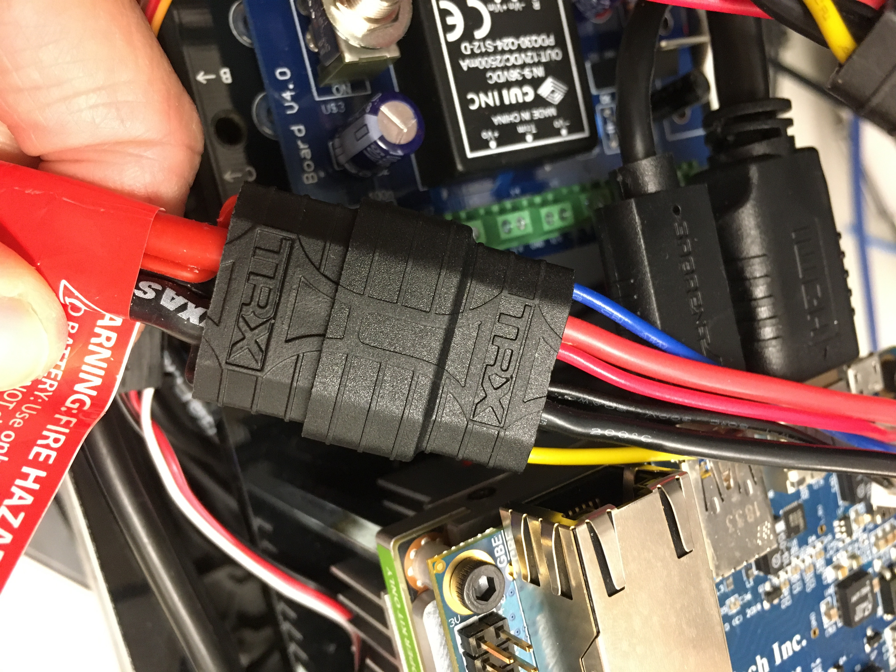

Next:

- Connect the VESC to your computer using a USB cable (a longer cable is recommended).

---

## 3. Connecting the VESC to Your Laptop

- Open **VESC Tool**
- On the welcome screen, click **AutoConnect** (bottom-left)
- Confirm connection status in the bottom-right corner

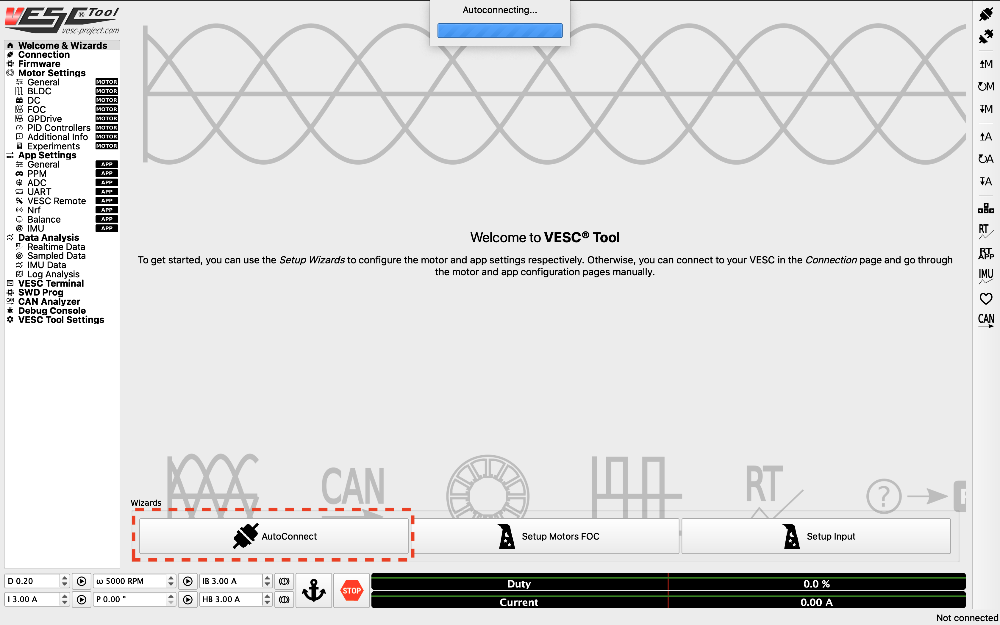

---

## 4. Updating the Firmware on the VESC

Update the firmware to ensure compatibility with motor control and servo output.

- Use **default firmware**
- Enable servo output:
  - Go to **App Settings → General → Enable Servo Output**
  - Set to `True`

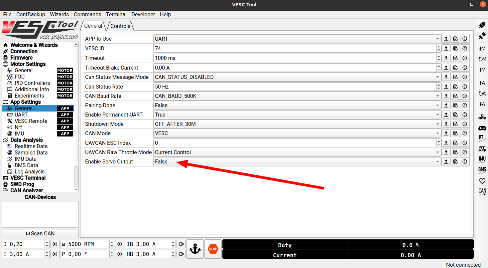

- Click **Write App Configuration** (down arrow + A)
  - This must be done whenever app settings are changed

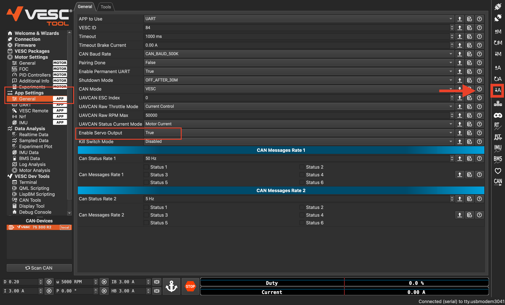

- Navigate to **Tools**
- Adjust the servo slider and verify that the steering responds correctly
- Return the servo to center after testing

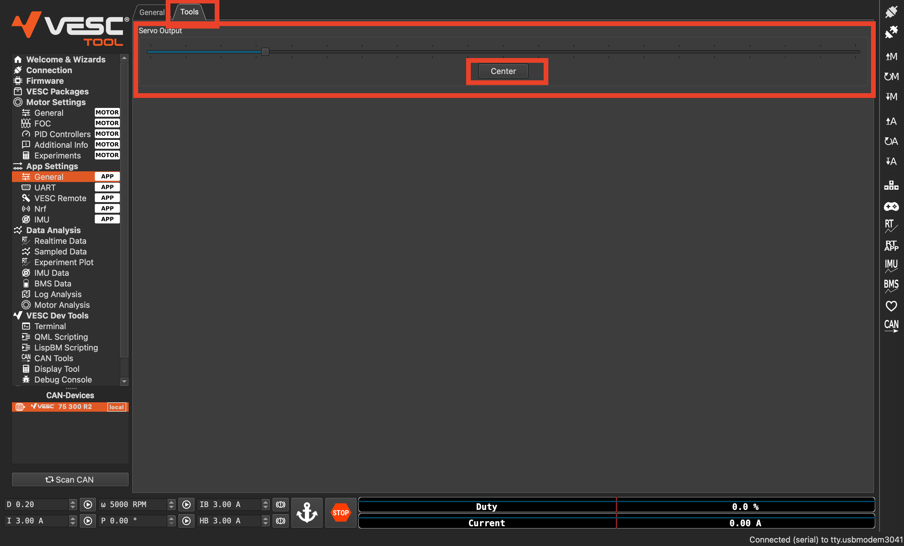

---

## 5. Setting Up Motor Configuration

- Open **Motor Settings**
- Launch the **Motor Setup Wizard**

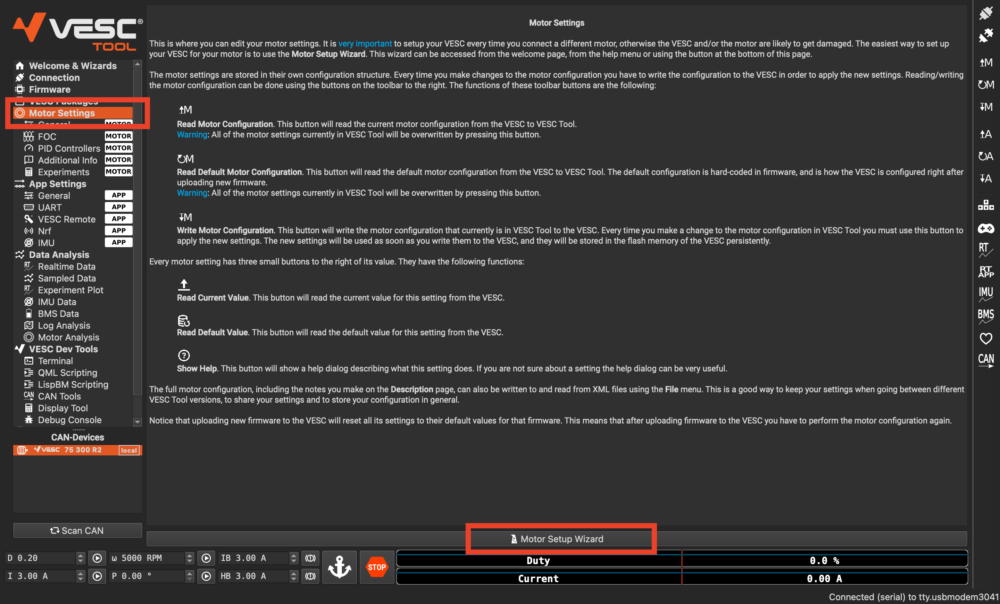

- If prompted to reset settings, select **No**
- Choose:
  - **Usage: Generic**
  - Click **Next**

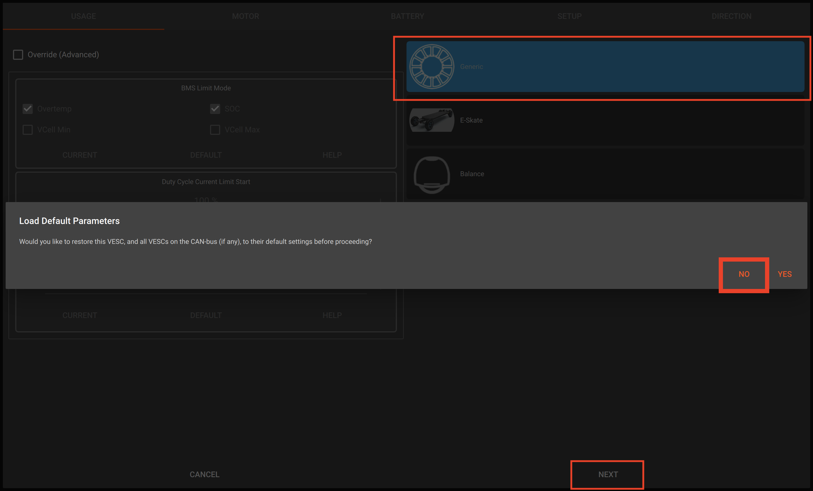

- Select motor type:
  - **Small Inrunner (~200g)**
- Click **Next**

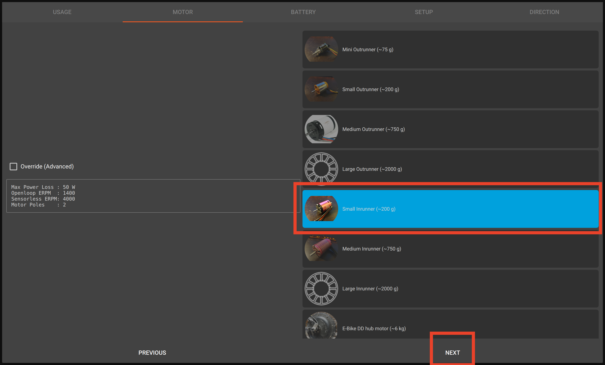

- Enter battery configuration:
  - Type, number of cells, and capacity
- Click **Next**

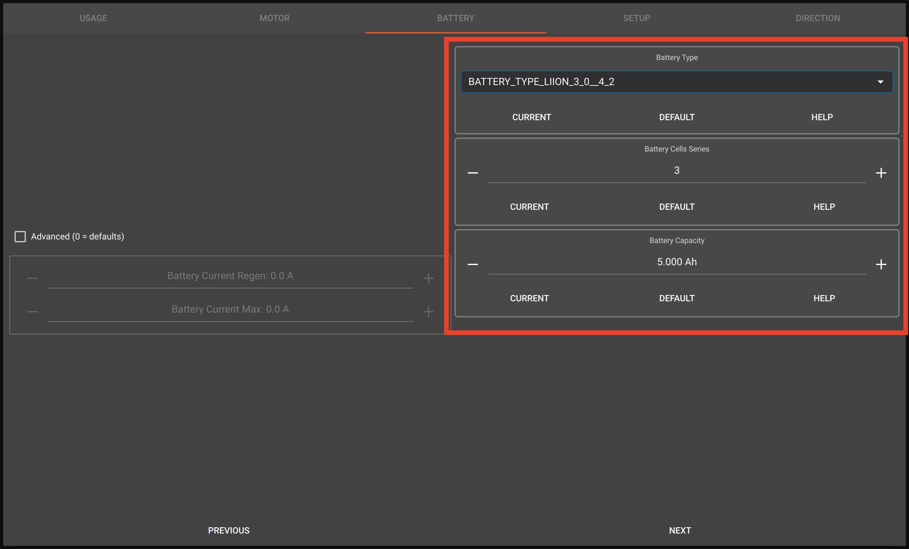

- Set wheel diameter
- Do not modify other settings unless necessary
- Click **Run Detection**

> **Safety Warning**
>
> Ensure the vehicle is secured on a stand, wheels are free to spin, and nothing is in contact with moving parts during detection.

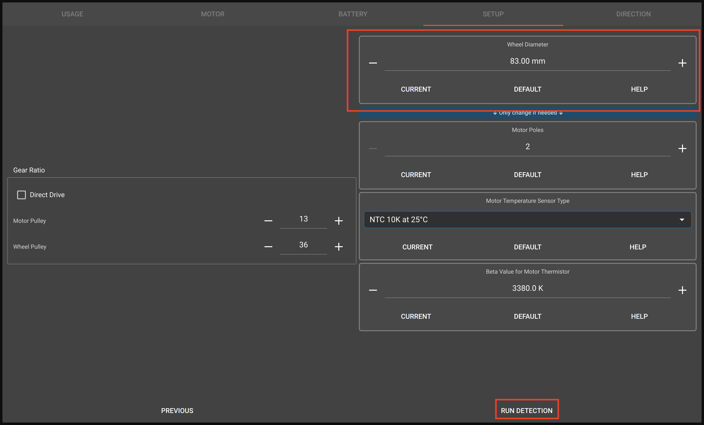

- When detection completes, click **OK**
- Verify motor direction:
  - **FWD = forward motion**
  - **REV = reverse motion**
- If reversed:
  - Enable **Invert Motor Direction**, or swap motor phase wires
- Click **Finish**

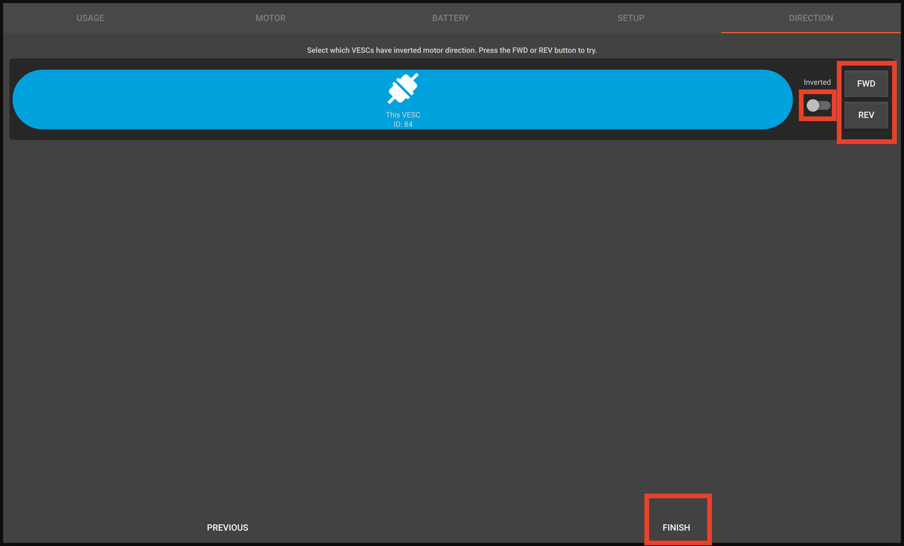

- Click **Write Motor Configuration** (down arrow + M)

> This must be clicked whenever motor settings are changed.

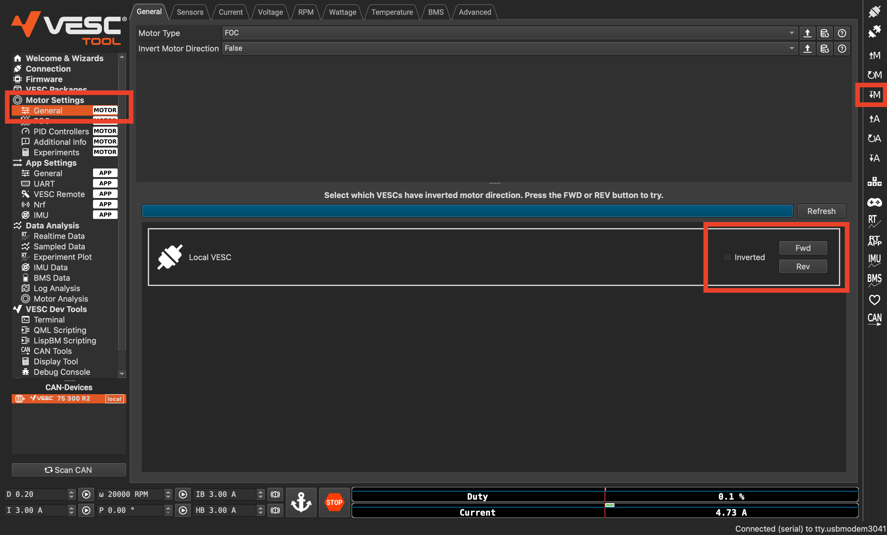

---

# Legacy Instructions (Reference Only)

## Configuring the VESC (Legacy Flow)

> Safety guidelines remain the same as above.

---

## 1. Installing VESC Tool (Legacy)

Install [VESC Tool](https://vesc-project.com/vesc_tool).  
Account creation is required (email only). Versions available for Linux, Windows, macOS.

---

## 2. Powering the VESC (Legacy)

- Plug in battery with correct polarity
- Powerboard is not required

- Disconnect USB from Jetson NX and connect to laptop

---

## 3. Connecting to VESC Tool

- Open VESC Tool
- Click **AutoConnect**
- Confirm connection in bottom-right

---

## 4. Firmware Update (Legacy Options)

### Newer VESC Tool versions (after Mar. 31, 2021)
- Use default firmware
- Enable servo output in **App Settings**

### Older versions (< 2.05)
- Go to **Firmware tab**
- Enable **Show non-default firmwares**
- Select `VESC_servoout.bin`
- Click download/upload arrow

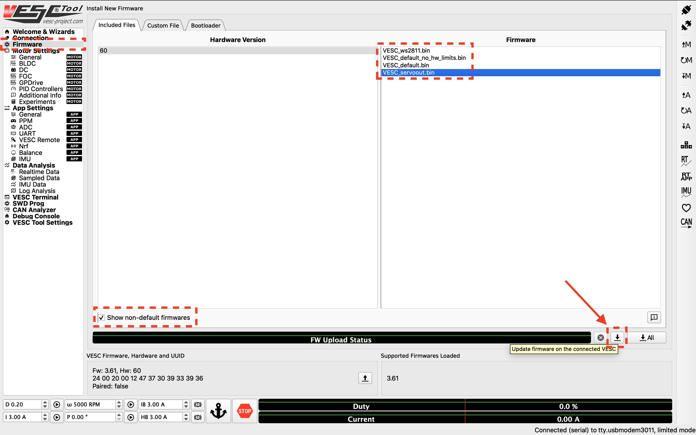

---

## 5. Motor Configuration via XML

- Load motor configuration XML file:
  - [Configuration File](https://drive.google.com/file/d/1-KiAh3hCROPZAPeOJtXWvfxKY35lhhTO/view?usp=sharing)
- Click **Write Motor Configuration**

> Required after any motor setting change

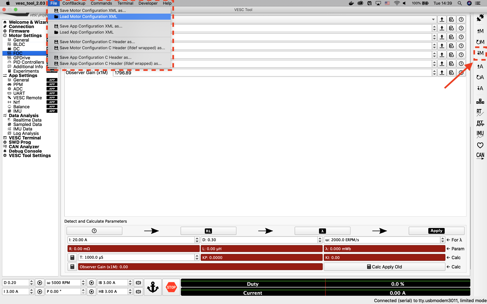

---

## 6. Motor Parameter Detection

- Navigate to **FOC Motor Settings**
- Run full detection sequence

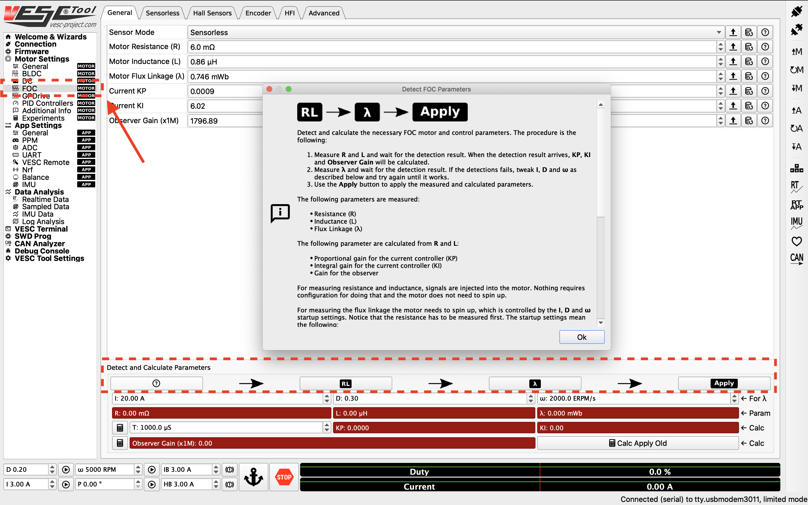

- Apply results
- Write configuration

---

## 7. Openloop Settings

- Go to **Sensorless tab**
- Set:
  - Openloop Hysteresis = `0.01`
  - Openloop Time = `0.01`

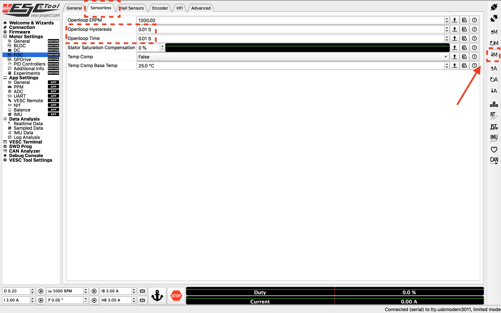

- Click **Write Motor Configuration**

---

## 8. PID Tuning

- Open **Realtime Data**
- Stream RPM data

### Testing
- Set RPM target (2000–10000)
- Run step response
- Stop when complete

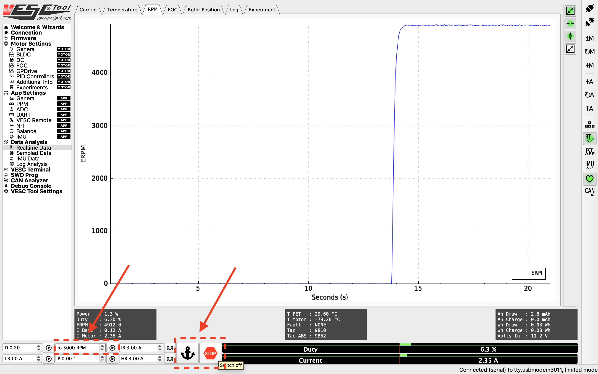

### Goal
- Fast response
- Minimal steady-state error
- No oscillation

### PID Adjustment
- Go to **PID Controllers**
- Tune speed gains

---

## 9. Hardware Speed Limit

- Go to **General Settings**
- Adjust **Max ERPM**

> Ensure ERPM limits align with odometry mapping in your software stack before increasing speed.

---

## *Acknowledgements*

>*This vehicle build is based on and follows a design philosophy similar to the open-source autonomous vehicle platform **RoboRacer (F1TENTH ecosystem)**.* 