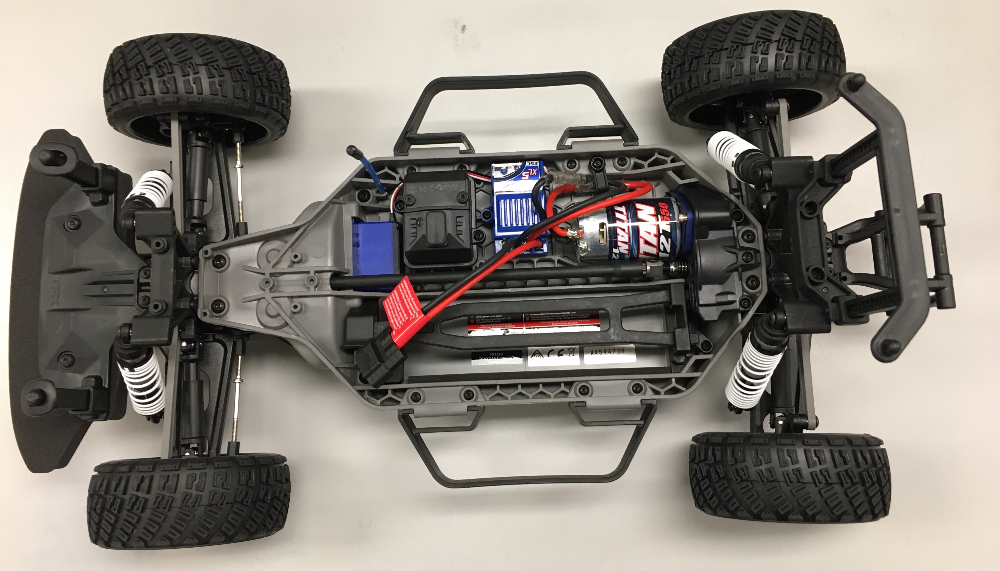
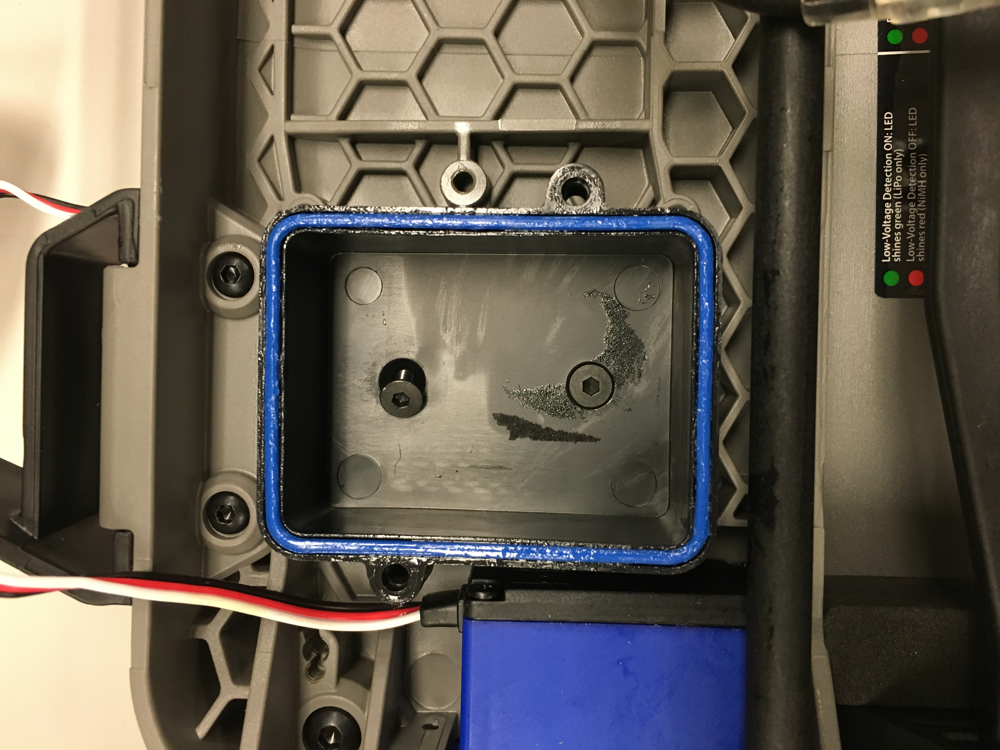
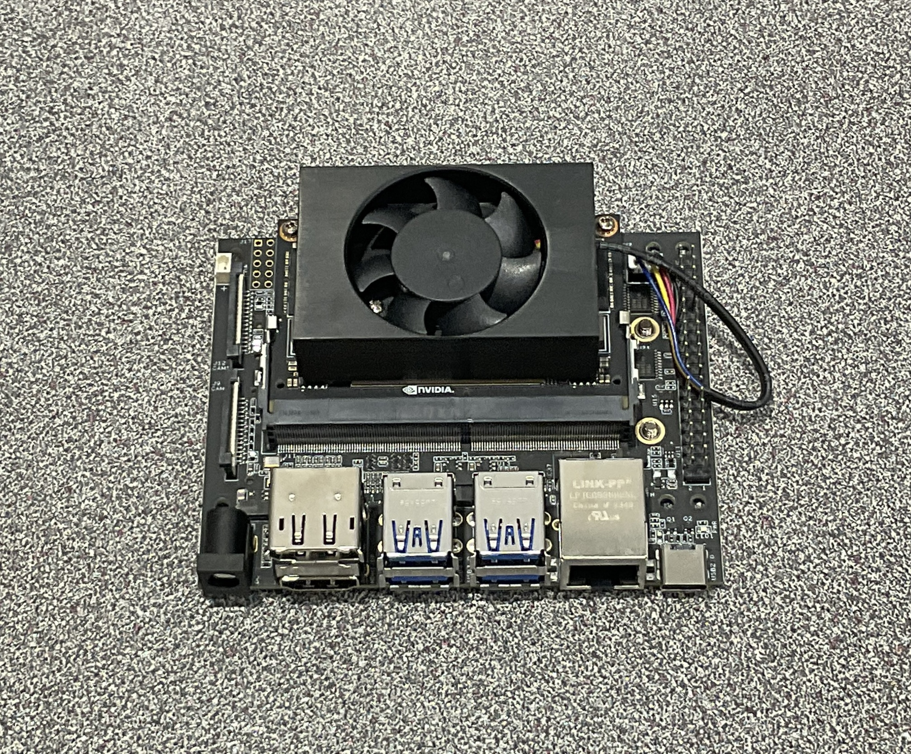
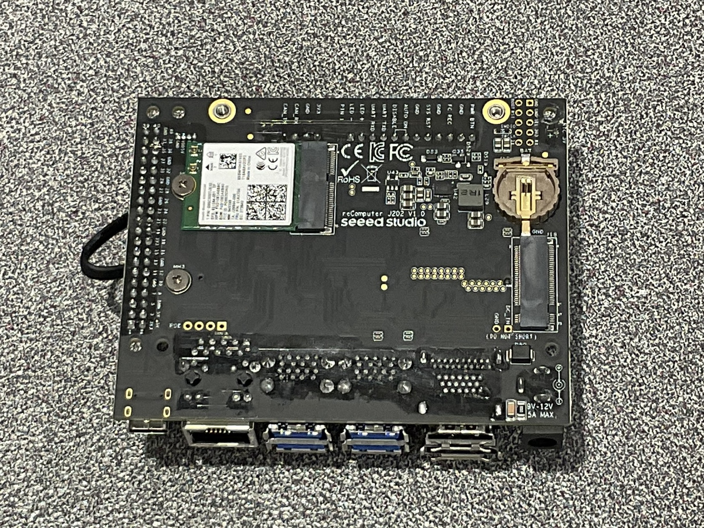
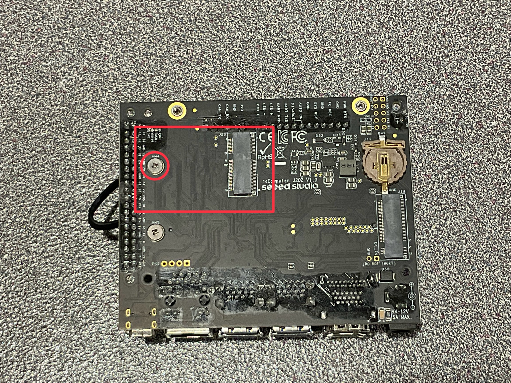
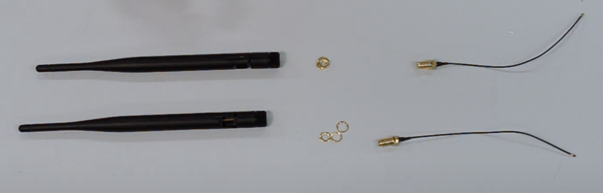
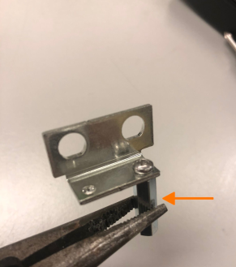
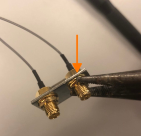

# Preparing The Physical Car Components

## 1. Removing Traxxas Stock Components

1. Unbox the Traxxas and remove everything, leaving you with the following:

   

2. Remove electrical assemblies, except for the Servo (the small blue box in the upper left).

### Removing Components

#### a. ESC (Electronic Speed Controller)

- Unscrew and remove the ESC
- Disconnect the wires from the Brushed Motor.

#### b. Receiver Box

- Unscrew and open the black Receiver Box.

   

- Disconnect the ESC control wire and the Servo control wire from the "TQ Top Qualifier" Receiver.
- Remove the Receiver, which is attached via double-sided tape.

   

- Unscrew the Receiver Box from the chassis.

   

- Use pliers or a screwdriver to remove the Antenna Tube.

> ### ***Any extra **PPM cables** can be tucked away properly since they will not be used. The only needed cables of the chassis are the **PPM Servo motor cables**, and the **3 cables with bullet connectors** coming from the motor***
>
---

## 3. Attaching the Standoffs to the Main Frame

1. Remove the two Nerf Bars (black handles) on either side of the chassis (4 screws per bar, accessible from underneath).
2. Attach three **M3 screws** and **three 45mm M3 FF standoffs** as shown:

   

3. Secure the standoffs with M3 screws from underneath.
4. Arrange the standoffs as follows:
   - **Two standoffs on the Motor side**
   - **One standoff on the Battery side** (for better battery access).
5. You can use thread-locking fluid to prevent loosening due to vibrations.

---

## 4. Setting Up the Battery

> **LIPO (LITHIUM POLYMER) BATTERY SAFETY WARNING**
>
> - **Monitor the battery while charging** and keep it in a fireproof bag on a non-flammable surface.
> - **Do not leave the battery connected** to the car when not in use.
> - **Immediately unplug** if you notice popping sounds, bloating, burning smells, or smoke.
> - **Never short the battery leads** or connect it backwards.

### Placing the Battery

- Place the battery into the compartment opposite the motor.

   

## 5. Preparing the NVIDIA Jetson NX

When purchased, the **NVIDIA Jetson NX** may come with an attached **small development board**, **WiFi antenna**, and/or a **case**. To mount it on the car, you need to remove all of them and have the board looking like the pictures below.

   
   

--

> ### Note:
> If the board does not come with a **WiFi Card** ***(see picture below)***, purchase one as it will be needed. The WiFi card it uses is: **WiFi Card M.2 Key E**
>
> 

---

## 6. Preparing the Wi-Fi Antennas

In this step, we prepare the **Wi-Fi antennas** for quick and easy mounting in later steps.

### Steps:

1. **Unpackage** your antennas and **detach the cables** from them.
2. Remove the **two brass-colored nuts** holding the antennas to the **L-shaped bracket**.
3. Take off the **two antennas** from the bracket.

   

4. **Screw standoffs onto the antenna bracket**:
   - Thread the **two screws** completely into the bracket.
   - Attach **two M3 FF 45mm standoffs** to the opposite ends of the screws.
   - Hand-tighten the standoffs, then use **pliers** to secure them while holding the screw head in place with a screwdriver.

   

5. **Reassemble the antennas**:
   - Place the **antennas and washers** back into the bracket.
   - Tighten the **brass nuts** onto the threaded connectors.
   - Use **two pairs of pliers**—one to hold the rear nuts and another to tighten the nuts on the antenna connectors.

   

---

## *Acknowledgements*

>*This vehicle build is based on and follows a design philosophy similar to the open-source autonomous vehicle platform **RoboRacer (F1TENTH ecosystem)**.* 