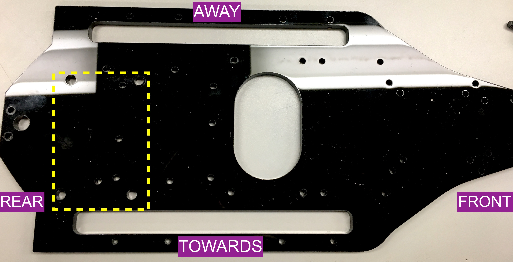
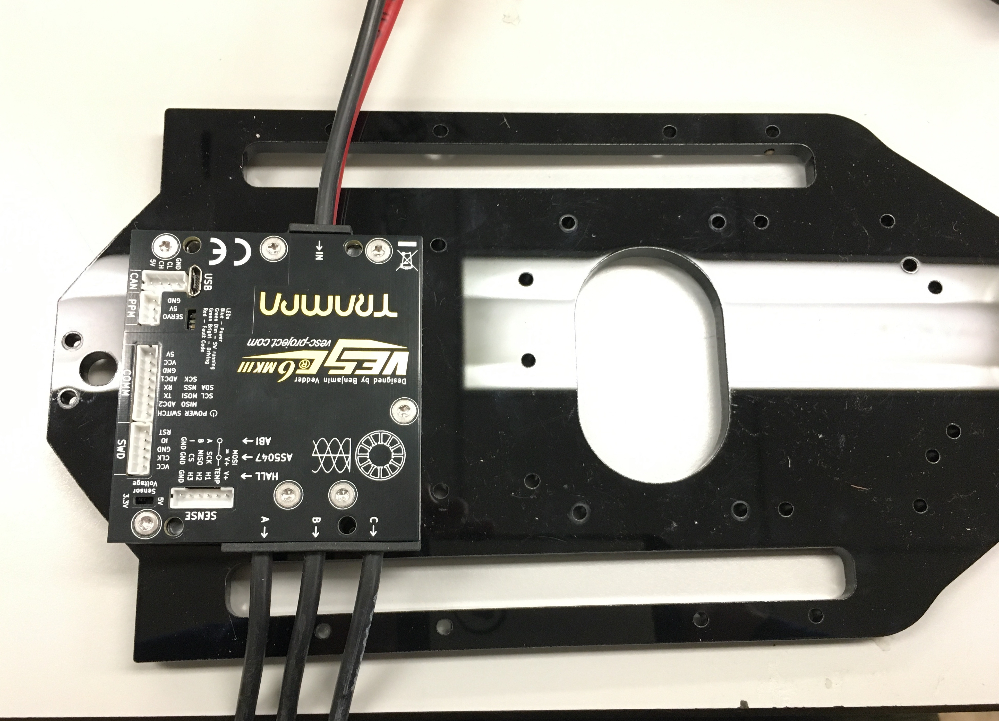
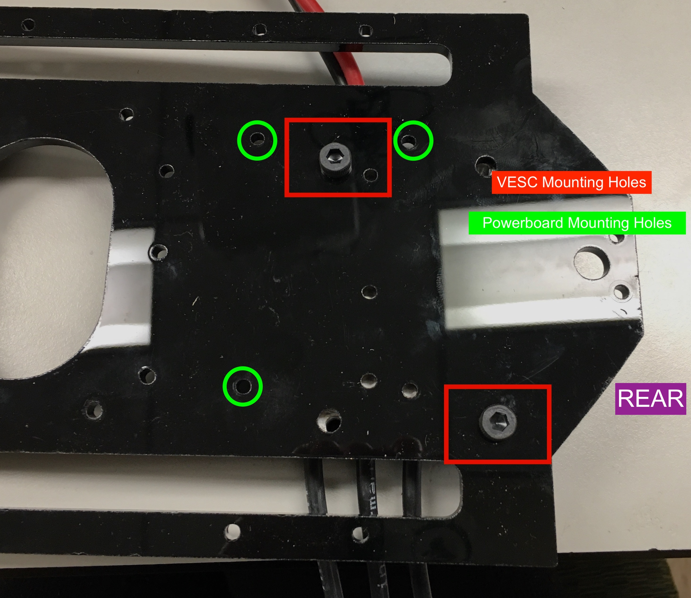
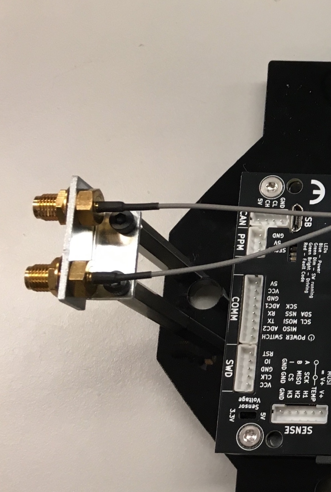
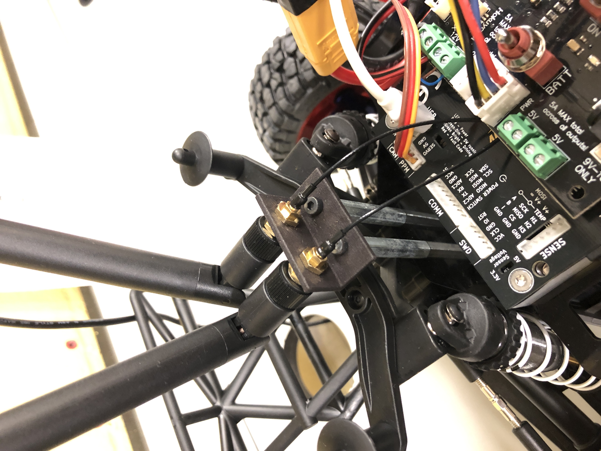
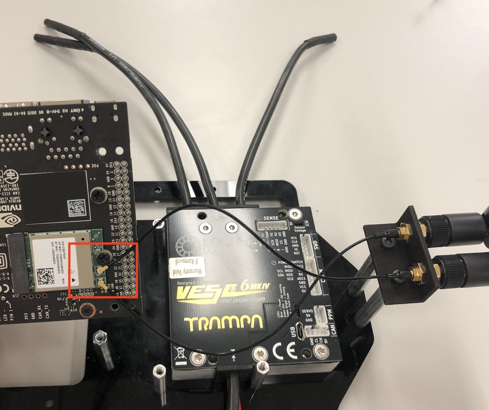
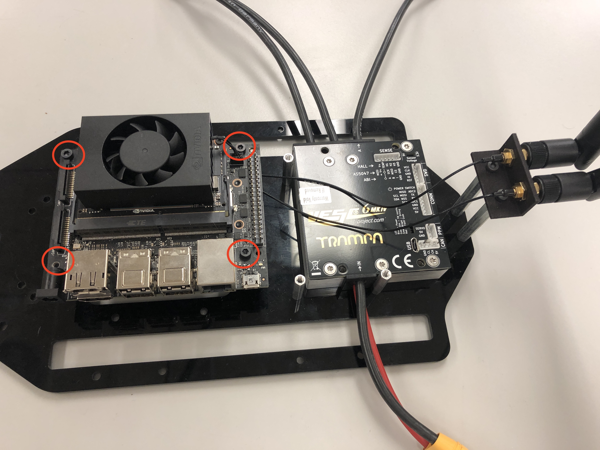
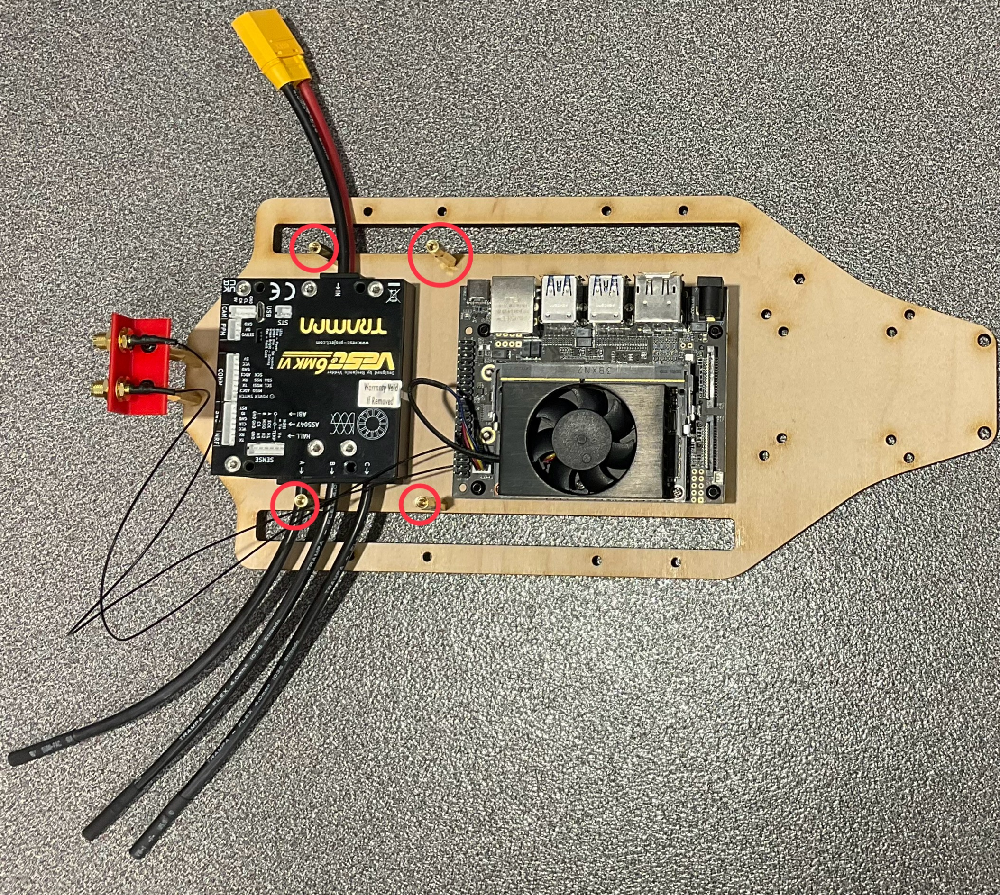
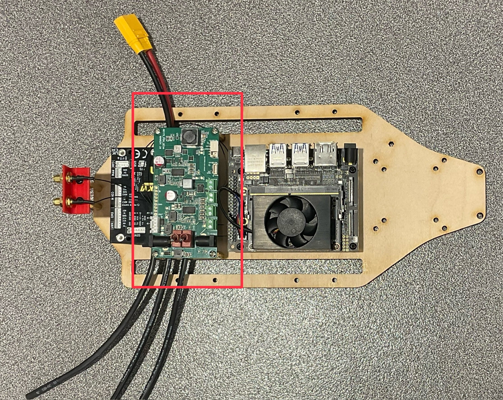
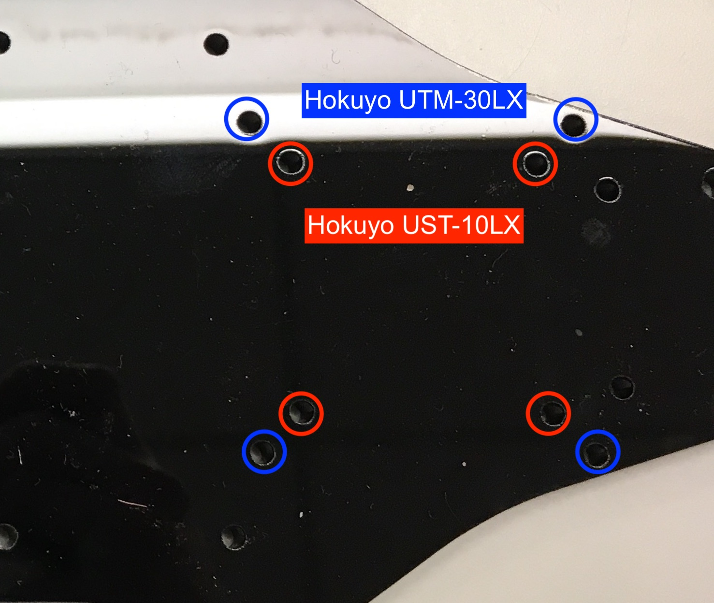

# Preparing the Mounting Deck

## 1. Preparing the Mounting Deck

Place the **Mounting Deck** in front of you as shown below.

The image below shows the five components we will mount on the **Mounting Deck**:

> ### ***Note that the screw holes have been adjusted in the new design to fit the new powerboard.***

---

## 2. Mounting the VESC

1. **Position the VESC** on the Mounting Deck:
   - **Power wires facing AWAY** from you.
   - **Three cables labeled A, B, and C facing TOWARDS** you.

   

2. **Secure the VESC**:
   - Flip the Mounting Deck and VESC over.
   - Use **two diagonal M5 screws** to attach the VESC.

   

---

## 3. Mounting the Antenna

1. **Mount the antenna standoffs and cables** at the rear of the VESC.
   - This allows the antenna cables to run beneath the powerboard and connect directly to the **NVIDIA Jetson NX** before installation.
   - Use an **M3 screw** to secure the antenna standoffs and cable.

   

2. **Attach the black antennas**:
   - Rotate them back onto the antenna mount, the same way they were removed.

   

---

## 4. Mounting the NVIDIA Jetson NX

1. **Connect the antenna cables first** before mounting the Jetson NX:
   - Flip the Jetson around.
   - **Make sure that the WiFi card and storage device are installed on the Jetson before mounting it**
   - Clip **both antenna cables** to the connectors on the Jetson.

   > ***Note that it might be a little hard to clip the connectors. Ensure that the connectors are compatible. (Buying the WiFi card and its antenna as a bundle is a way to ensure compatibility.)***

   

2. **Install M3 standoffs for the Jetson**:
   - Screw the **standoffs** into the Mounting Deck at the designated Jetson NX mounting holes.
   - Thread the **M3 screw from underneath** and secure it with a **25mm standoff**.

   

3. **Mount the Jetson NX**:
   - Place the Jetson NX onto the **mounted standoffs**.
   - Secure it using **M3 screws** through the four main holes on top of the Jetson.
   - Secure the **Powerboard** to the **25mm standoff** with an **M3 x 8mm screw**.

   

---

## 5. Mounting the Powerboard

1. Flip the **Mounting Deck (with VESC attached) back over**.
2. Use **M3 screws** threaded from underneath and secure with **25mm or 30mm standoffs**.
   - The image below shows the **four mounting standoffs** for the Powerboard.

   

3. Secure the **Powerboard** to the standoffs using **M3 screws**.

   

4. **Ensure proper spacing**:
   - There should be a **clear gap between the Powerboard and the VESC**.

---

## 6. Mounting the Lidar

1. The last component to mount is the **Lidar**.
   - This guide uses the **Hokuyo UTM-30LX**.
   - The mounting holes for the **Hokuyo UST-10LX** are slightly different.

   

2. **Use four M3 screws** to secure the Lidar **from underneath**.

   

---

## *Acknowledgements*

>*This vehicle build is based on and follows a design philosophy similar to the open-source autonomous vehicle platform **RoboRacer (F1TENTH ecosystem)**.* 